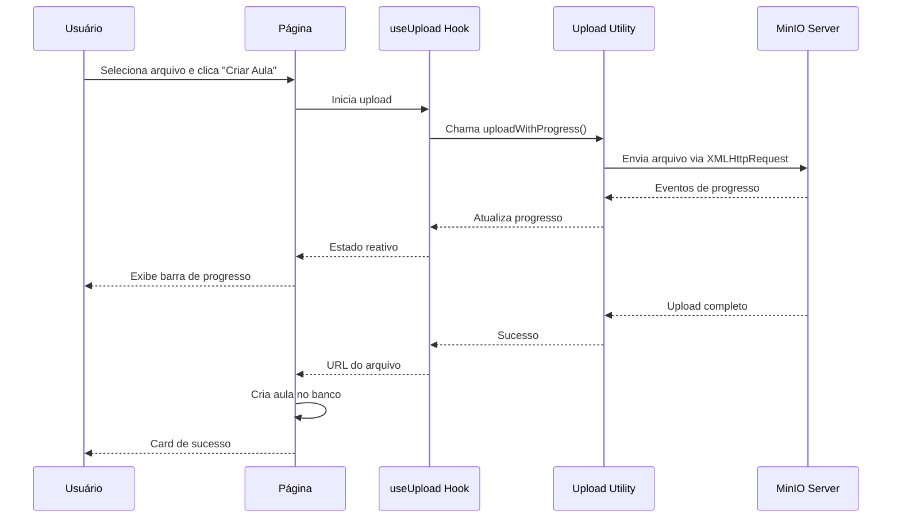

# Design Document

## Overview

Esta solução restaura a funcionalidade de barra de progresso de upload na página `/minhas-aulas/adicionar` através da implementação de três componentes principais: um utilitário de upload com XMLHttpRequest para capturar progresso, um hook React personalizado para gerenciar estado, e componentes visuais para exibir o progresso em tempo real. A solução mantém a compatibilidade com o sistema MinIO existente e garante uma experiência de usuário profissional.

## Architecture

### Componentes Principais

1. **Upload Utility (`lib/upload-with-progress.ts`)**
   - Implementa XMLHttpRequest para capturar eventos de progresso
   - Calcula velocidade de upload e tempo estimado
   - Mantém compatibilidade com URLs do MinIO existente

2. **Upload Hook (`hooks/use-upload.ts`)**
   - Gerencia estado do upload (idle, uploading, success, error)
   - Fornece interface reativa para componentes
   - Controla ciclo de vida do upload

3. **Progress Components (`components/upload-progress.tsx`)**
   - Componente inline para exibir progresso
   - Card de sucesso para confirmação final
   - Design responsivo e acessível

4. **Page Integration (`app/minhas-aulas/adicionar/page.tsx`)**
   - Integração com formulário existente
   - Controle de estado dos campos
   - Navegação pós-sucesso

### Fluxo de Dados



## Components and Interfaces

### 1. Upload Utility Interface

```typescript
interface UploadProgress {
  loaded: number
  total: number
  percentage: number
  speed: number // bytes/second
  timeRemaining: number // seconds
  stage: string
}

interface UploadOptions {
  onProgress?: (progress: UploadProgress) => void
  onSuccess?: (url: string) => void
  onError?: (error: string) => void
}

function uploadWithProgress(
  url: string, 
  file: File, 
  options: UploadOptions
): Promise<string>
```

### 2. Upload Hook Interface

```typescript
interface UseUploadReturn {
  isUploading: boolean
  progress: UploadProgress | null
  error: string | null
  upload: (file: File, userId: string, type: 'video' | 'file') => Promise<string>
  reset: () => void
}

function useUpload(options?: {
  onSuccess?: (result: string) => void
  onError?: (error: string) => void
}): UseUploadReturn
```

### 3. Progress Components Interface

```typescript
interface UploadProgressInlineProps {
  isUploading: boolean
  progress: UploadProgress | null
  fileName: string
  error: string | null
}

interface UploadSuccessCardProps {
  aulaTitle: string
  onVoltar: () => void
}
```

## Data Models

### Progress State Model

```typescript
interface ProgressState {
  // Upload status
  isUploading: boolean
  isComplete: boolean
  hasError: boolean
  
  // Progress data
  loaded: number // bytes uploaded
  total: number // total file size
  percentage: number // 0-100
  speed: number // bytes per second
  timeRemaining: number // seconds
  stage: string // "Enviando arquivo...", "Processando...", etc.
  
  // File info
  fileName: string
  fileSize: number
  
  // Error handling
  error: string | null
}
```

### Form State Model

```typescript
interface FormState {
  // Existing form data
  curso_id: string
  modulo_id: string
  titulo: string
  // ... outros campos
  
  // Upload state
  selectedFile: File | null
  uploadProgress: ProgressState | null
  
  // UI state
  fieldsDisabled: boolean
  showSuccessCard: boolean
}
```

## Error Handling

### Upload Errors

1. **Network Errors**
   - Timeout após 5 minutos
   - Retry automático (1 tentativa)
   - Mensagem clara para o usuário

2. **File Validation Errors**
   - Tipo de arquivo inválido
   - Tamanho excede limite (3GB)
   - Arquivo corrompido

3. **Server Errors**
   - MinIO indisponível
   - Erro de autenticação
   - Espaço insuficiente

### Error Recovery

```typescript
// Estratégia de recuperação
const handleUploadError = (error: Error) => {
  // Log do erro
  console.error('Upload failed:', error)
  
  // Reset do estado
  setUploadState({ isUploading: false, error: error.message })
  
  // Reabilitar campos
  setFieldsDisabled(false)
  
  // Toast de erro
  toast({
    variant: "destructive",
    title: "Erro no upload",
    description: error.message
  })
}
```

## Testing Strategy

### Unit Tests

1. **Upload Utility Tests**
   - Teste de cálculo de progresso
   - Teste de cálculo de velocidade
   - Teste de estimativa de tempo
   - Teste de tratamento de erros

2. **Hook Tests**
   - Teste de estados do upload
   - Teste de transições de estado
   - Teste de cleanup
   - Teste de callbacks

3. **Component Tests**
   - Teste de renderização condicional
   - Teste de formatação de dados
   - Teste de interações do usuário
   - Teste de responsividade

### Integration Tests

1. **Upload Flow Tests**
   - Teste de upload completo
   - Teste de cancelamento
   - Teste de erro de rede
   - Teste de arquivo grande

2. **Form Integration Tests**
   - Teste de desabilitação de campos
   - Teste de navegação pós-sucesso
   - Teste de persistência de dados
   - Teste de validação

### Performance Tests

1. **Upload Performance**
   - Teste com arquivos de diferentes tamanhos
   - Teste de múltiplos uploads simultâneos
   - Teste de memória durante upload
   - Teste de cancelamento rápido

## Implementation Notes

### Compatibilidade com MinIO

A solução mantém total compatibilidade com o sistema MinIO existente:

```typescript
// Usa as mesmas funções de URL do sistema atual
const { getMinioUserUploadUrl } = await import("@/lib/minio-config")
const uploadUrl = getMinioUserUploadUrl(userId, tipo, fileName)
```

### Performance Considerations

1. **Throttling de Updates**
   - Progresso atualizado a cada 100ms máximo
   - Evita re-renders excessivos
   - Mantém UI responsiva

2. **Memory Management**
   - Cleanup de event listeners
   - Reset de estado após upload
   - Garbage collection de objetos grandes

3. **Network Optimization**
   - Timeout configurável
   - Retry logic inteligente
   - Compressão quando possível

### Accessibility

1. **Screen Readers**
   - ARIA labels para progresso
   - Anúncios de status
   - Descrições de erro claras

2. **Keyboard Navigation**
   - Foco gerenciado durante upload
   - Escape para cancelar
   - Tab order preservado

3. **Visual Indicators**
   - Alto contraste na barra
   - Animações reduzidas (prefers-reduced-motion)
   - Texto legível em todos os tamanhos